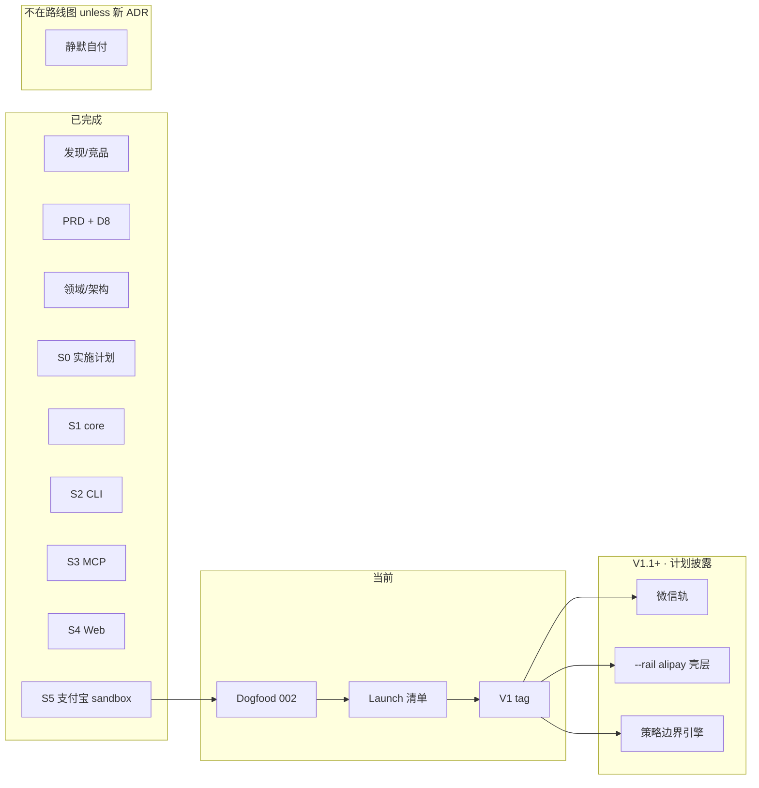

# Roadmap · 青蚨使 / Qingfu Envoy

> **Open-source disclosure:** 本文与链接文档为对外路线图与计划披露；细节以仓库内权威文档为准，**不另维护私有路线图**。  
> License: [Apache-2.0](LICENSE)

## 一句话

**Qingfu Envoy（青蚨使）** 是 Agent 付款的**开源控制面**：Envoy **提议** → 主理人 **确认** → 支付宝等**持牌通道**执行。我们不是支付机构，**不做静默自付**（见 [ADR 001](docs/decisions/001-no-license-no-silent-pay.md)）。

---

## 当前状态（截至 2026-08-22）

| 维度 | 状态 |
|------|------|
| 产品规格 | ✅ PRD、成功指标、领域模型已定稿 |
| 实施计划 | ✅ [implementation-plan-v1](docs/design/implementation-plan-v1.md) + [审计 100/100](docs/design/IMPLEMENTATION-PLAN-AUDIT.md) |
| V1 垂直切片 | ✅ **S1–S5 闭合**；`npm test` 62+ 绿（rails sandbox 无 env 则 skip） |
| 实现审计 | ✅ S1 [100/100](docs/design/S1-IMPLEMENTATION-AUDIT.md)；S2–S5 本地审计完成 |
| 下一门禁 | **Dogfood**（[ADR 002](docs/decisions/002-dogfood-first.md)）→ launch 清单 → V1 标签 |
| 真轨 | `rails-alipay` 适配器就绪；CLI/Web **默认 Mock**；sandbox 凭证可选实跑 |

我们**不**用虚假进度条：每个阶段以 [stage-spec DoD](docs/design/stage-specs/) 勾选为准。

---

## 路线图总览

**依赖纪律：** 代码 `S1 → S2 → (S3 ∥ S4) → S5` 已闭合；发布 `Dogfood → Private → Announce`（见 [launch-plan](docs/product/launch-plan.md)）。

---

## 里程碑与交付物

| 里程碑 | 阶段 | 类型 | 交付物（对外可见） | 状态 |
|--------|------|------|-------------------|------|
| M0 规格冻结 | ①–③ | 文档 | PRD、D8、领域、追溯矩阵 | ✅ |
| M0.5 计划披露 | S0 | 文档 | 实施计划 + 审计 + **本 ROADMAP** | ✅ |
| M1 可信内核 | S1 | 代码 | `@qingfu/core` | ✅ |
| M2 主理人 CLI | S2 | 代码 | `qingfu` CLI + dogfood | ✅ |
| M3 Agent 接入 | S3 | 代码 | `@qingfu/mcp`；**无 blind execute** | ✅ |
| M4 任务面 | S4 | 代码 | `@qingfu/web`（127.0.0.1） | ✅ |
| M5 真轨骨架 | S5 | 代码 | `@qingfu/rails-alipay`（env 可 skip） | ✅ |
| **V1 标签** | S1–S5 | 发布 | README 三端演示；[launch 检查清单](docs/product/launch-plan.md) | ⏳ Dogfood 后 |
| V1.1 | — | 代码 | 微信轨；`--rail alipay`；Web 鉴权 | 📋 已披露未排期 |
| V1.2 | — | 代码 | 策略边界（品类/商户/时窗） | 📋 P2，需 PRD 修订 |
| 静默自付 | — | — | **不在路线图** | 🚫 ADR 001 |

图例：✅ 完成 · ⏳ 当前 · 📋 已规划 · 🚫 明确不做

---

## V1 范围披露（做 / 不做）

### 做

- 人确认后付款；完整审计链；JSON 导出  
- 急停（冻结 Envoy）、取消未决、**解冻**  
- 对已执行提议的**退款请求**（成功 / 失败 / 轨不支持）  
- **CLI + MCP + 本地 Web** 三端  
- **Mock 轨** + **支付宝 sandbox** 适配器  
- 单机、自托管、密钥不进仓库  

### 不做（V1）

| 项 | 原因 |
|----|------|
| 静默自付 / 额度内免确认扣款 | [ADR 001](docs/decisions/001-no-license-no-silent-pay.md) |
| 自建清算、收单、备付金 | 无牌照 |
| 赔付基金 | 非个人开源阶段能力 |
| 微信生产轨 | [ADR 003](docs/decisions/003-v1-surfaces-and-rail.md) → V1.1+ |
| 公网多租户 SaaS | 超出控制面定位 |
| x402 / 链上默认轨 | PRD P2 |

完整列表见 [PRD Non-Goals](docs/product/prd.md#non-goals-v1)。

---

## 10 分钟三端 Dogfood（Mock）

| 端 | 入口 |
|----|------|
| CLI | [packages/cli/README.md](packages/cli/README.md) |
| MCP | [packages/mcp/README.md](packages/mcp/README.md) |
| Web | [packages/web/README.md](packages/web/README.md) |

周记模板：[dogfood-journal](docs/delivery/dogfood-journal.md)。

---

## 计划披露（我们如何规划与执行）

### 1. 决策公开

所有产品边界裁定写入 [ADR](docs/decisions/000-decision-log.md)，编号引用、不口头漂移：

| ADR | 要点 |
|-----|------|
| [001](docs/decisions/001-no-license-no-silent-pay.md) | 无牌照；禁止静默自付 |
| [002](docs/decisions/002-dogfood-first.md) | 先 dogfood 验证信任 |
| [003](docs/decisions/003-v1-surfaces-and-rail.md) | 三端分期；支付宝优先 |
| [004](docs/decisions/004-refund-and-freeze-semantics.md) | 退款入口；急停只挡新提议 |

### 2. 实施计划公开

- 任务级计划：[implementation-plan-v1.md](docs/design/implementation-plan-v1.md)  
- 计划审计：[IMPLEMENTATION-PLAN-AUDIT.md](docs/design/IMPLEMENTATION-PLAN-AUDIT.md)  
- 工单索引：[tickets.md](docs/delivery/tickets.md)  

### 3. 阶段门禁公开

每阶段 [stage-spec](docs/design/stage-specs/) 列出**机器可验证 DoD**；未勾选不得宣称该阶段完成。

### 4. 成功指标公开

[D8 成功指标](docs/product/success-metrics.md)：北极星、leading/lagging、**反指标**（无人确认扣款必须恒为 0）。

### 5. 竞品与能力景观

[调研文档](docs/research/2026-08-22-agentic-payment-capability-landscape.md) 为**远期行业景观**，**不是** V1 承诺范围。

---

## 时间预期（诚实说明）

我们**不追求极速**，**不设对外虚假日期**。当前进入 **Dogfood → V1 标签** 阶段。

| 阶段 | 粗略量级（维护者估算，非承诺） |
|------|-------------------------------|
| Dogfood | 4 周或 ≥20 笔允准（002） |
| Private beta | ≤10 人试用 |
| V1 标签 | launch 清单全绿后 |
| V1.1 | 按 Issue + 新 ADR |

---

## 文档地图（贡献者入口）

| 读者 | 从这里开始 |
|------|------------|
| 所有人 | [README](README.md) → **本 ROADMAP** |
| 产品/范围 | [PRD](docs/product/prd.md) |
| 架构 | [architecture](docs/design/architecture.md) |
| 实现 | [implementation-plan-v1](docs/design/implementation-plan-v1.md) |
| 过程纪律 | [0→1 路径](docs/product/0-1-path.md) |
| 全索引 | [docs/README.md](docs/README.md) |
| 贡献 | [CONTRIBUTING](CONTRIBUTING.md) |

---

## 参与与反馈

- **Issue**：讨论范围、报告与 ADR 冲突的行为  
- **PR**：请标明对应 Ticket / Task ID；须绿 `npm test`  
- **安全**：密钥勿入 PR；支付相关变更须对照 ADR 001、004  

发布节奏见 [launch-plan](docs/product/launch-plan.md)。

---

## English summary

**Qingfu Envoy** is an open-source **agent payment control plane** (not a licensed PSP). Agents **propose** payments; humans **approve**; licensed rails **execute**. **No silent auto-pay** in V1. **S1–S5 code complete**; next: **dogfood** then **V1 release tag**. Full specs in-repo; progress gated by public stage-spec DoD and D8 metrics.
